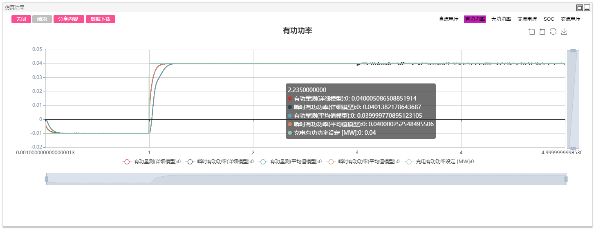
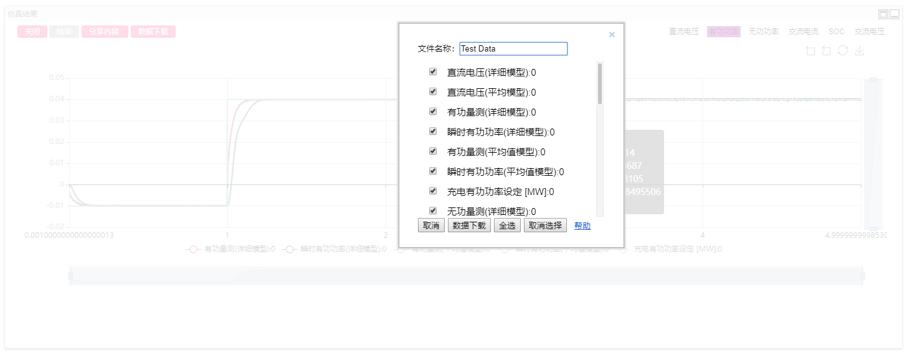
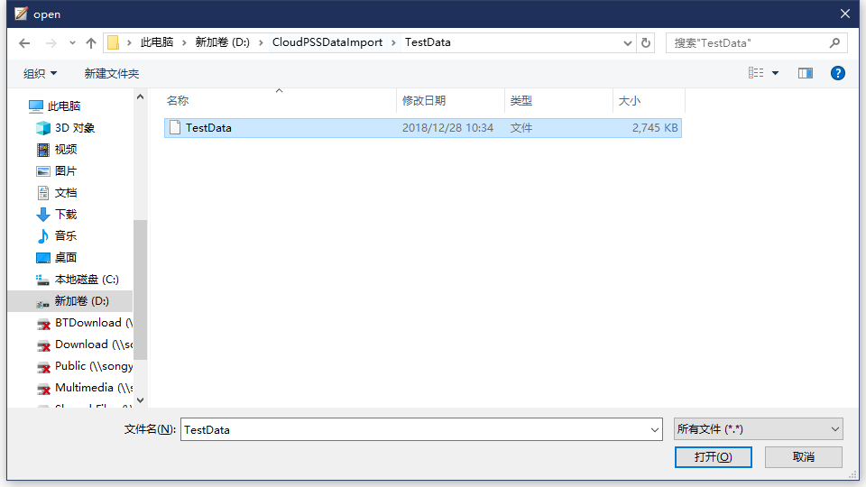

# CloudPSSDataImport

Import CloudPSS simulation results into Matlab workspace. 将CloudPSS仿真结果下载导入进Matlab工作区。

1. Run the simulation in CloudPSS workspace. 在CloudPSS工作台中运行仿真，得到仿真结果。


2. Download the Results. 下载仿真结果。


3. Run `CloudPSSDataImport.m` in Matlab, and select the result file. 在Matlab中运行`CloudPSSDataImport.m`，选择需要导入的结果。 


The results will be stored in Matlab workspace as channel structs `Ch_XX`, i.e.,
结果会自动解析并存储在Matlab工作台中的`Ch_XX`通道结构体中。通道数据对应关系显示在命令行窗口中，如下，

```
导入完成!
Ch_1 -> 直流电压(平均模型):0
Ch_2 -> 有功量测(平均值模型):0
Ch_3 -> 无功量测(平均值模型):0
Ch_4 -> 并网点线电流有效值(平均值模型):0
Ch_5 -> 储能电池SOC(平均模型):0
Ch_6 -> 瞬时有功功率(平均值模型):0
Ch_7 -> 瞬时无功功率(平均值模型):0
Ch_8 -> 并网点交流电流(平均值模型):0
Ch_9 -> 并网点交流电流(平均值模型):1
Ch_10 -> 并网点交流电流(平均值模型):2
Ch_11 -> 并网点电压(平均值模型):0
Ch_12 -> 并网点电压(平均值模型):1
Ch_13 -> 并网点电压(平均值模型):2
Ch_14 -> 充电有功功率设定 [MW]:0
Ch_15 -> 直流电压(详细模型):0
Ch_16 -> 有功量测(详细模型):0
Ch_17 -> 无功量测(详细模型):0
Ch_18 -> 并网点线电流有效值(详细模型):0
Ch_19 -> 储能电池SOC(详细模型):0
Ch_20 -> 瞬时有功功率(详细模型):0
Ch_21 -> 瞬时无功功率(详细模型):0
Ch_22 -> 并网点交流电流(详细模型):0
Ch_23 -> 并网点交流电流(详细模型):1
Ch_24 -> 并网点交流电流(详细模型):2
Ch_25 -> 并网点电压(详细模型):0
Ch_26 -> 并网点电压(详细模型):1
Ch_27 -> 并网点电压(详细模型):2
```
3. Fianlly, use ```plot(Ch_1.Data(:,1),Ch_1.Data(:,2))``` to draw the curves.
